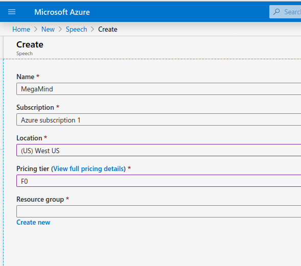

# MegaMind installation!

In this document we provide step-by-step guide on how to install MegaMind on a new system. 

[Compile and install Alexa Device SDK](./Compile_SDKs.md)

[Register AVS devices in Amazon Voice Service](./AVS_account.md)

[Run AVS devices SampleApplication on your machine](./Run_SDK.md)

[Install, register and run MegaMind transcriber skill](./Third_party.md)


#  Install Azure Speech SDK for third-party speech-to-text service

First let's clone our speech application:
```bash
	cd $HOME/MegaMind
	git clone https://github.com/mjstalebi/MegaMind_Azure_Speech.git
```
Now we download the Azure Speech c++ SDK into this folder. 
```bash
	cd MegaMind_Azure_Speech
	wget -O Azure_SDK.tar.gz  https://aka.ms/csspeech/linuxbinary
	tar xvzf Azure_SDK.tar.gz	
```
before Compiling our Speech Application, we need to install some dependencies:
```bash
	sudo apt-get update
	sudo apt-get install libssl1.0.0 libasound2
```
Then open "MegaMind_Azure_speech.cpp" and find the following line:
```c++
	auto config = SpeechConfig::FromSubscription("XXX", "XXX");

```
you need to replace XXXs with the information you get from your Azure Speech service.

To register for Azure Speech Service, you need to first creat an Azure account and sign in to your Azure Portal. Then you can follow the instructions bellow.


Click on "Creat a resource"


In the search bar serach for "Speech" and click on the first result "Speech"


Click on "Creat" button




Enter the information as above. (F0 means free for limited use.)
Click on "Create new" and create new resource group with your arbitrary name. Then Click on "Create resource"


After Azure finishes creating your resource you can click on "Go to resource" button.


Here you can find the subscription key you need to make your Speech Application under Key1.


After you replaced XXXs in "MegaMind_Azure_speech.cpp" with your subscription key and region:
```c++
	auto config = SpeechConfig::FromSubscription(your key, your region);

```
you are ready to make the Speech Application
```bash
	cd $HOME/MegaMind/MegaMind_Azure_Speech
	make
```

