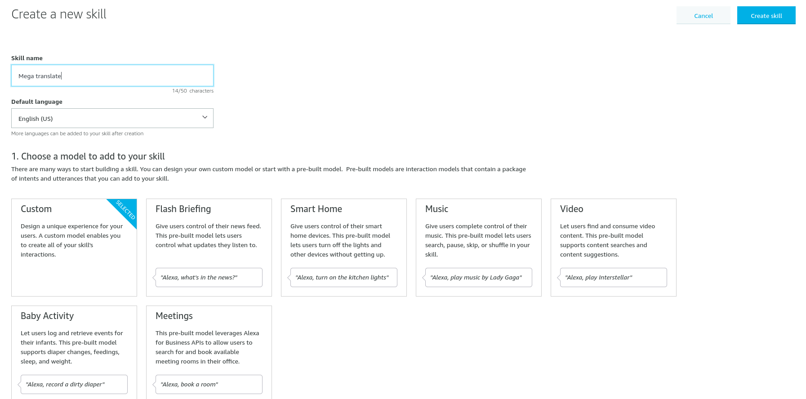
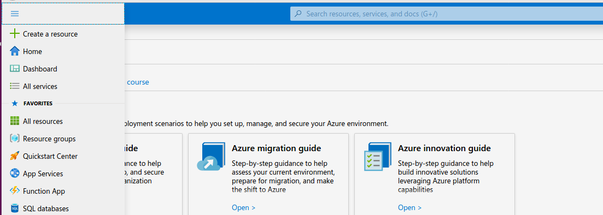
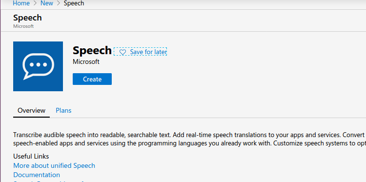

# MegaMind installation!

In this document we provide step-by-step guide on how to install MegaMind on a new system. 

[Compile and install Alexa Device SDK](./Compile_SDKs.md)

[Register AVS devices in Amazon Voice Service](./AVS_account.md)


# Run the device SDK

First we need to provide the Client ID for each SDK for authentication purposes.
```bash
	cd $HOME/MegaMind/MegaMind_device_SDK1/build/Integration
	vim AlexaClientSDKConfig_backup.json
```

And insert this information in it
```json
{
   "deviceInfo":{
     "deviceSerialNumber":"123456",
     "clientId":"XXXX CLIENT_ID XXXX",
     "productId":"MegaMind_device1"
   },  
   "cblAuthDelegate":{
       "databaseFilePath":"XXHOMEXX/MegaMind/MegaMind_device_SDK1/application-necessities/cblAuthDelegate.db"
   },  
   "miscDatabase":{
       "databaseFilePath":"XXHOMEXX/MegaMind/MegaMind_device_SDK1/application-necessities/miscDatabase.db"
   },  
   "alertsCapabilityAgent":{
       "databaseFilePath":"XXHOMEXX/MegaMind/MegaMind_device_SDK1/application-necessities/alerts.db"
   },  
   "settings":{
       "databaseFilePath":"XXHOMEXX/MegaMind/MegaMind_device_SDK1/application-necessities/settings.db",
       "defaultAVSClientSettings":{
           "locale":"en-US"
       }
   },  
   "certifiedSender":{
      "databaseFilePath":"XXHOMEXX/MegaMind/MegaMind_device_SDK1/application-necessities/certifiedSender.db"
   },  
   "notifications":{
       "databaseFilePath":"XXHOMEXX/MegaMind/MegaMind_device_SDK1/application-necessities/notifications.db"
   }   
}

```

Replace the "XXXX CLIENT_ID XXXX" with the client ID from the previous step. 
And replace "XXHOMEXX" with the absolute address of where you created MegaMind folder on your machine.
Repeat the same steps for Device SDK2. 

Then to run each of the Device SDKs first go to the build directory.
```bash
	cd $HOME/MegaMind/MegaMind_device_SDK1/build
	vim run.sh
```
and insert the following code into the run.sh
```bash
	rm Integration/AlexaClientSDKConfig.json
	cp Integration/AlexaClientSDKConfig_backup.json Integration/AlexaClientSDKConfig.json
	./SampleApp/src/SampleApp Integration/AlexaClientSDKConfig.json ../third-party/snowboy/resources/  NONE

```

repeat the same steps for the second SDK.

Now you can run each device SDK by only issuing run.sh

Note: the first time you run each SDK. It ask you to login to your amazon account and insert a code to complete the two step verification.

#  Install Alexa Skills Kit SDK for Python
The ASK SDK for Python requires **Python 2 (>= 2.7)** or **Python 3 (>= 3.6)**. Before continuing, make sure you have a supported version of Python installed

First you need to clone the our repository for MegaMind Skill:
```bash
cd $HOME/MegaMind
git clone https://github.com/mjstalebi/MegaMind_Skill.git
```
Then we can install the sdk and use our Skill.
```bash
cd $HOME/MegaMind/MegaMindSkill
python3 setup.py build
source run_MegaMind.sh
```
then open another terminal and 
```bash
cd $HOME/MegaMind/MegaMindSkill
source get_ngrok.sh
source ngrok_run.sh
```
Then we use the public url generated by ngrok to register our Skill with Amazon.

#  Register Megamind Skill in Alexa voice service
first sign-in to your Amazon developer console.
Among four options you see in the home page, choose Amazon Alexa.


In the next page, click on three dots on the top right corner of the page. From the drop down menu, please select Alexa Developer Console.


In Alexa Developer Console click on "Create Skill"


In the next page fill Skill Name with "Mega translate Skill" and press "Create Skill"


In the next page choose "Start fro scratch"


Click on "Invocation" tab from the tabs in left side of the webpage and fill Skill Invocation Name with "mega translate"

Click on add button next to the "Intent" tab  from the tabs in left side of the webpage . Then choose Create custom intent

In Sample "Utterances(0)" type : search for {phrase}
and click on Add button next to the phrase.
click on the small "+" button in right side of the text box to add the utterance

In Intent Slots , select phrase and choose "AMAZON.SearchQuery" for its type

Click on Endpoint tab tab  from the tabs in left side of the webpage . Then select HTTPs for "Service Endpoint Type"
Enter the public https address you got from ngrok in the previous state in the "Default Region" tab. and choose "My development endpoint is a sub-domain of a domain that has a wildcard certificate from a certificate authority" for certificate type.

Then at the top of the same page. Click on "Save Endpoints"


Again from the tabs on left side of the page choose "Intents" tab. At the top of this page click on: "Save Model" and "Build Model"


Your Skill is ready to test. 
To test the Skill go to "Test" tab at the top of the same page. Then send these requests:
```
open mega translate
search for what time is it?
```
This should invoke the proper intents in your Skill, and you should see that the Skill on your computer prints the intents it receives.


#  Install Azure Speech SDK for third-party speech-to-text service

First let's clone our speech application:
```bash
	cd $HOME/MegaMind
	git clone https://github.com/mjstalebi/MegaMind_Azure_Speech.git
```
Now we download the Azure Speech c++ SDK into this folder. 
```bash
	cd MegaMind_Azure_Speech
	wget -O Azure_SDK.tar.gz  https://aka.ms/csspeech/linuxbinary
	tar xvzf Azure_SDK.tar.gz	
```
before Compiling our Speech Application, we need to install some dependencies:
```bash
	sudo apt-get update
	sudo apt-get install libssl1.0.0 libasound2
```
Then open "MegaMind_Azure_speech.cpp" and find the following line:
```c++
	auto config = SpeechConfig::FromSubscription("XXX", "XXX");

```
you need to replace XXXs with the information you get from your Azure Speech service.

To register for Azure Speech Service, you need to first creat an Azure account and sign in to your Azure Portal. Then you can follow the instructions bellow.



Click on "Creat a resource"


In the search bar serach for "Speech" and click on the first result "Speech"




Click on "Creat" button


Enter the information as above. (F0 means free for limited use.)
Click on "Create new" and create new resource group with your arbitrary name. Then Click on "Create resource"


After Azure finishes creating your resource you can click on "Go to resource" button.


Here you can find the subscription key you need to make your Speech Application under Key1.


After you replaced XXXs in "MegaMind_Azure_speech.cpp" with your subscription key and region:
```c++
	auto config = SpeechConfig::FromSubscription(your key, your region);

```
you are ready to make the Speech Application
```bash
	cd $HOME/MegaMind/MegaMind_Azure_Speech
	make
```

