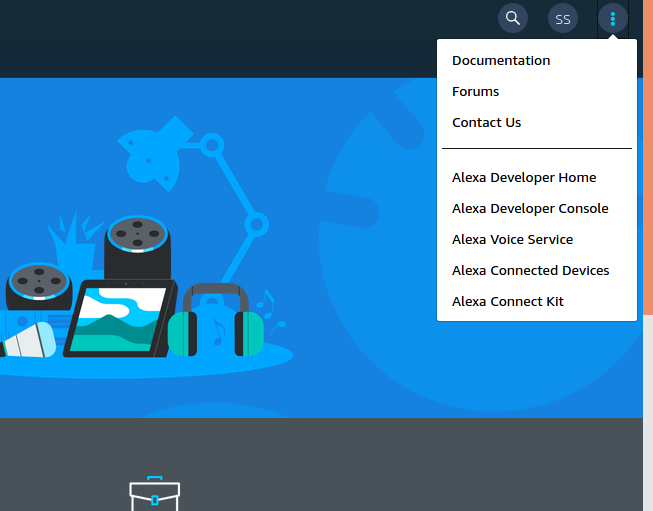
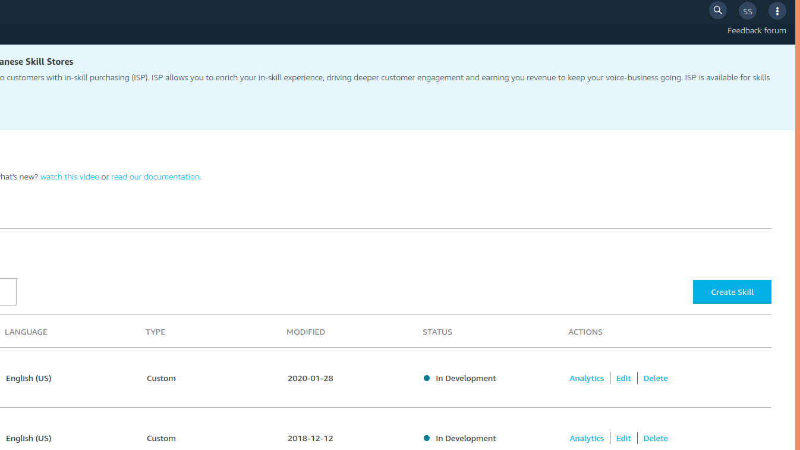
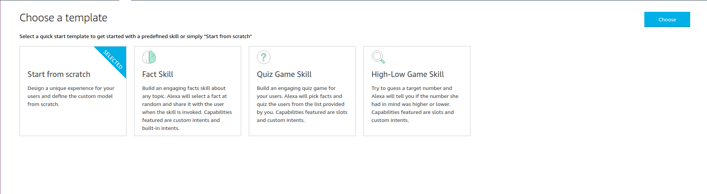
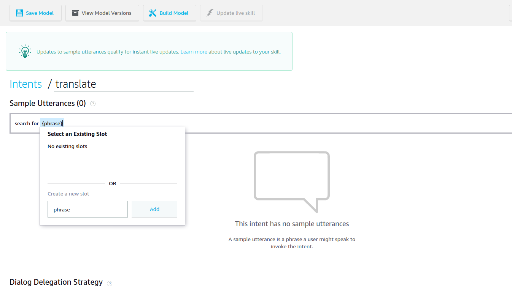
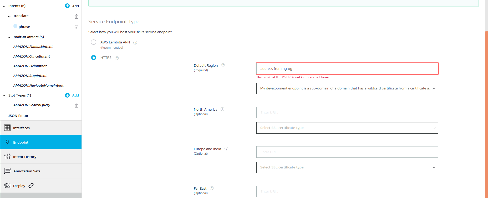
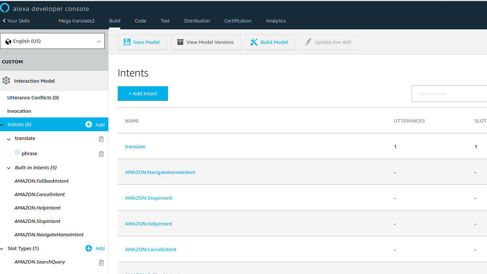

#  Install Alexa Skills Kit SDK for Python
The ASK SDK for Python requires **Python 2 (>= 2.7)** or **Python 3 (>= 3.6)**. Before continuing, make sure you have a supported version of Python installed

First you need to clone the our repository for MegaMind Skill:
```bash
cd $HOME/MegaMind
git clone https://github.com/mjstalebi/MegaMind_Skill.git
``` 
First we need to install python setup tools.
```bash
sudo apt-get install python3-setuptools
```
Then we can install the sdk and use our Skill.
```bash
cd $HOME/MegaMind/MegaMindSkill
python3 setup.py build
source run_MegaMind.sh
```
then open another terminal and 
```bash
cd $HOME/MegaMind/MegaMindSkill
source get_ngrok.sh
source ngrok_run.sh
```
Then we use the public url generated by ngrok to register our Skill with Amazon.

#  Register Megamind Skill in Alexa voice service
first sign-in to your Amazon developer console.
Among four options you see in the home page, choose Amazon Alexa.


In the next page, click on three dots on the top right corner of the page. From the drop down menu, please select Alexa Developer Console.


In Alexa Developer Console click on "Create Skill"


In the next page fill Skill Name with "Mega translate Skill" and press "Create Skill"


In the next page choose "Start fro scratch"


Click on "Invocation" tab from the tabs in left side of the webpage and fill Skill Invocation Name with "mega translate"

Click on add button next to the "Intent" tab  from the tabs in left side of the webpage . Then choose Create custom intent

In Sample "Utterances(0)" type : search for {phrase}
and click on Add button next to the phrase.
click on the small "+" button in right side of the text box to add the utterance

In Intent Slots , select phrase and choose "AMAZON.SearchQuery" for its type

Click on Endpoint tab tab  from the tabs in left side of the webpage . Then select HTTPs for "Service Endpoint Type"
Enter the public https address you got from ngrok in the previous state in the "Default Region" tab. and choose "My development endpoint is a sub-domain of a domain that has a wildcard certificate from a certificate authority" for certificate type.

Then at the top of the same page. Click on "Save Endpoints"


Again from the tabs on left side of the page choose "Intents" tab. At the top of this page click on: "Save Model" and "Build Model"


Your Skill is ready to test. 
To test the Skill go to "Test" tab at the top of the same page. Then send these requests:
```
open mega translate
search for what time is it?
```
This should invoke the proper intents in your Skill, and you should see that the Skill on your computer prints the intents it receives.
